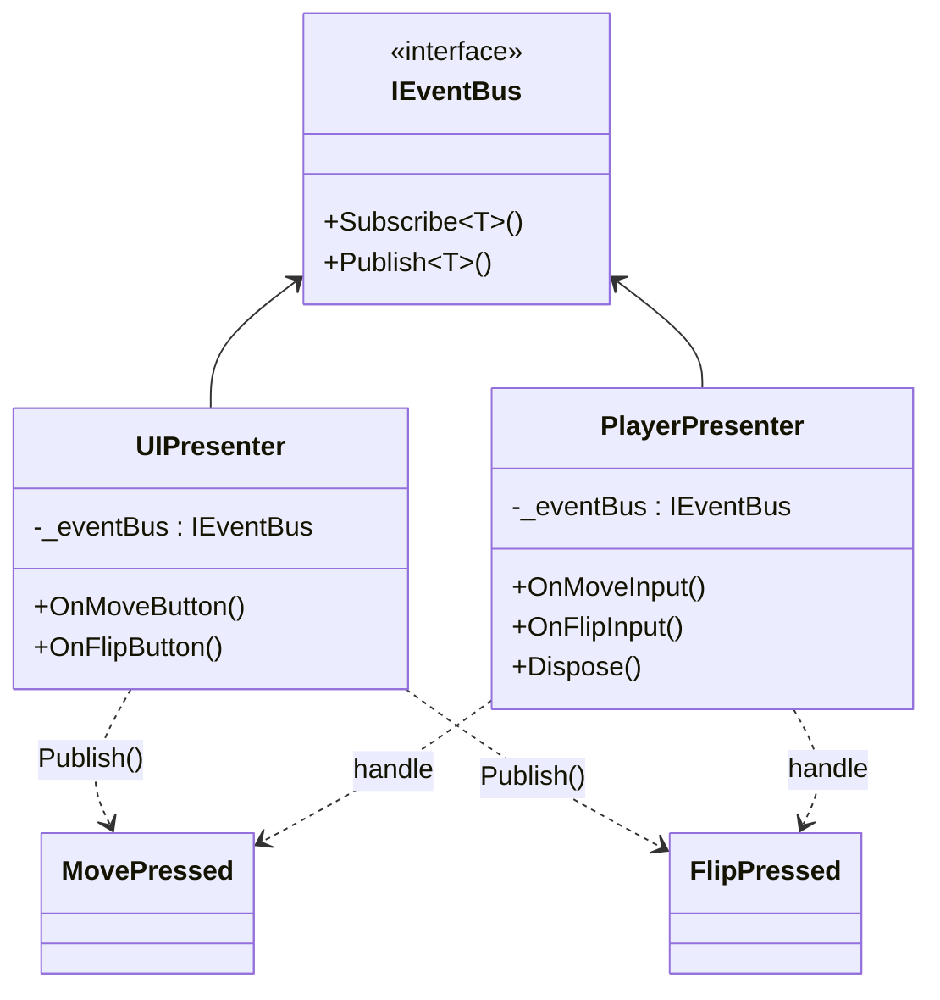
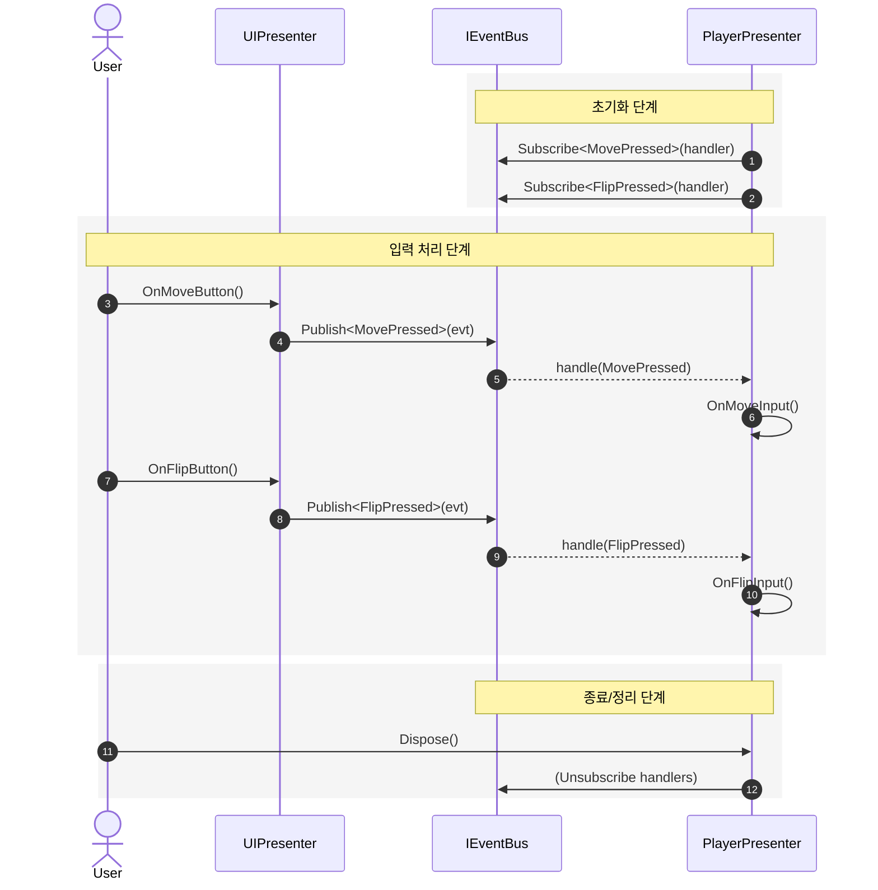

# 26.01_SBS_TeamProject
> 본 프로젝트는 SBS 게임 아카데미 학원의 2026년 겨울 방학 팀 프로젝트로 제작된 '무한의 게임' 모작 게임으로, 불타는 빌딩에서 제한 시간 안에 아래층으로 탈출하는 하이퍼 캐주얼 타임어택 아케이드 게임입니다. 
이퍼 캐주얼 타임어택 아케이드 게임

## 프로젝트 개요
- **플랫폼**: Android
- **엔진**: Unity 6 (6000.2.12.f1)(URP)
- **개발 기간**: 2026.01 ~ 진행 중
- **개발 도구**: C#
- **버전 관리**: Git, GitHub
- **데이터 관리**: 
- **아키텍쳐 패턴**: MVP
- **개발 인원**: 4인

## 구현상세
#### 1. **플레이어 이동 구현**

